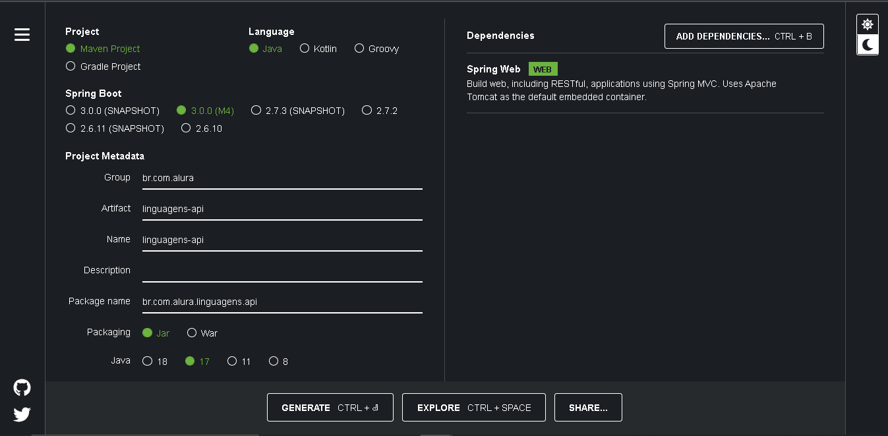

# Imersão Java Alura 

### Projeto criado na semana de Imersão Java Alura. O projeto foi desenvolvido na plataforma intelliJ, utilizamos como framework o Spring,integrando com o MongoDb e Heroku como cloud.

### **Temas Abordados:**
- Aula 01 - Consumindo uma api de filmes com Java
- Aula 02 - Gerando figurinhas para whatsapp
- Aula 03 - Ligando as pontas, refatoração e orientação a objetos
- Aula 04 - Criando nossa própria api com Spring
- Aula 05 - Publicando nossa api no cloud

- **Aula 01 - Consumindo uma api de filmes com Java**

Api's Alternantivas ao IMDB

- (https://mocki.io/v1/9a7c1ca9-29b4-4eb3-8306-1adb9d159060) criada pelo @rezendecas
- (https://alura-imdb-api.herokuapp.com/movies) criada pelo Jhon Santana

*Opção para criação no Visual Studio

- Install Visual Studio Code for Java

https://code.visualstudio.com/docs/languages/java#_install-visual-studio-code-for-java

No visual Studio:

- ctrl + shift + p
- Java Create Java project
- opção: No build tools

**links úteis**

 https://www.alura.com.br/artigos/desenvolvendo-aplicacoes-java-vs-code

- **Aula 02 - Gerando figurinhas para whatsapp**

**links úteis**

- Java Polimorfismo: entenda herança e interfaces - Alura

https://www.alura.com.br/conteudo/java-heranca-interfaces-polimorfismo

- Java e Orientação a Objetos - Alura

https://www.alura.com.br/apostila-java-orientacao-objetos/apendice-pacote-java-io

- **Aula 03 - Ligando as pontas, refatoração e orientação a objetos**

Consumindo uma nova Api

- Api Nasa

https://api.nasa.gov/planetary/apod?api_key=DEMO_KEY&start_date=2022-07-10&end_date=2022-07-15

- Apis - Alternativas caso a da Nasa não Funcione

https://api.mocki.io/v2/549a5d8b/NASA-APOD

https://raw.githubusercontent.com/alura-cursos/imersao-java/api/NASA-APOD.json

Separando o código em clases (Refatoração)

**links úteis**
- Como não aprender Java e Orientação a Objetos: getters e setters - Alura

https://www.alura.com.br/artigos/nao-aprender-oo-getters-e-setters

- **Aula 04 - Criando nossa própria api com Spring**

**Spring:** 

- Documentação: https://spring.io/
- Iniciar um Projeto (**Spring initializr**): https://start.spring.io/

**Configuração inicial (Spring boot):** 

- clicar em GENERATE

- Irá gerar um zip, é necessário extrair, mova a pasta para um outro local

- Abrir com IntelliJ

**MongoDB:** 

https://www.mongodb.com/cloud/atlas/register

- Criar Conta

- Criar new project

- Clicar em collections e Add My Own Data

- Em create Database:   
    - ***Database name:*** aluraDB  
    - ***Collection name:*** principaisLinguagens
    - Clicar em **Create**.

**Criando o banco, clicar em *INSERT DOCUMENT*:**

-  Clicar nas chaves e inserir os dados em formato JSON.

**Pegando connection string:**

- Em Overview ir CONNECT, e Connect your application, copie a connection string.

- Na aplicação dentro da pasta **resources**, ir  em **application.properties** colar a string de conexão

**Conectando o banco de dados com a aplicação**
 
- Ir no site **Spring initializr**
- Procurar dependência **"Spring Data MongoDB"**
-Colar o seguinte código nas dependências no arquivo **pom.xml**
    
        <dependency>
        <groupId>org.springframework.boot</groupId>
    
        <artifactId>spring-boot-starter-data-mongodb</artifactId>
        </dependency>

- Baixar as novas dependências

-  Voltando em **application.properties**, digitar as seguintes informações:

        spring.data.mongodb.uri = mongodb+srv://FernandoLopes92:<SENHA>@cluster0.xtgbf1l.mongodb.net/aluraDB?retryWrites=true&w=majority

- Consumir api's no POSTMAN

**links úteis**

- Maven: (caso necessário, IntelliJ já tem)

https://maven.apache.org/download.cgi - 

- Postman:

 https://www.postman.com/

- GitHub com logos das linguagens de programação

https://github.com/abrahamcalf/programming-languages-logos

- **Aula 05 - Publicando nossa api no cloud**

